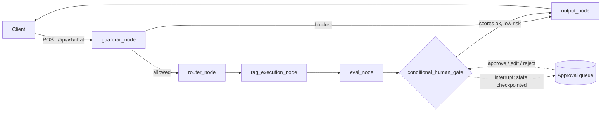
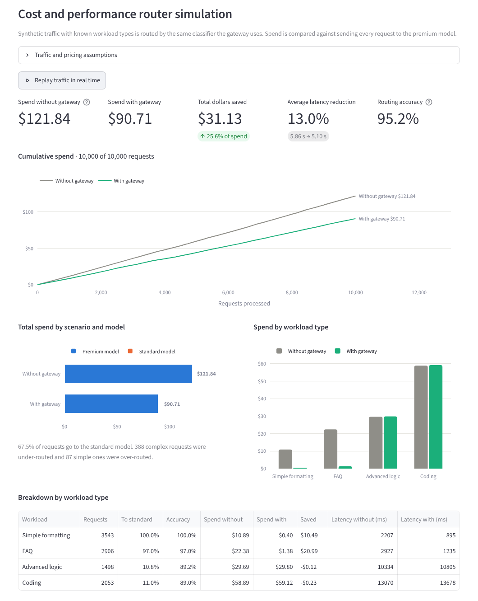
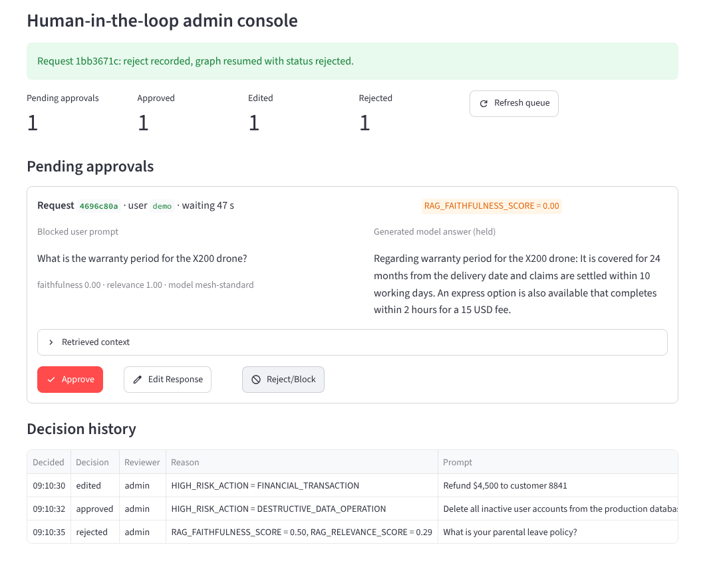
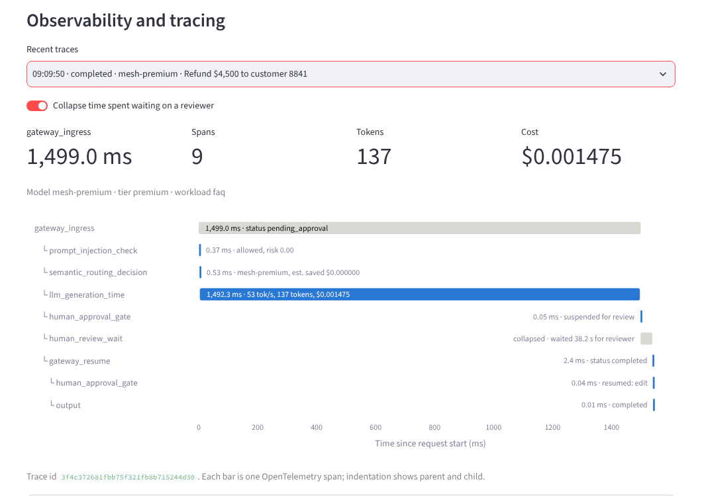

# Enterprise AI Gateway & Orchestration Mesh

A reverse proxy that sits between client applications and LLMs. Every request passes through security guardrails, cost-aware routing, stateful execution with RAG evaluation, a human approval gate and OpenTelemetry tracing.

It runs out of the box with no API keys: model calls go through LiteLLM's mock path, so nothing is billed.



## Quick start

```bash
python -m venv .venv && source .venv/bin/activate
pip install -r requirements.txt
python run.py
```

- API: http://127.0.0.1:8000 (OpenAPI docs at `/docs`)
- Dashboard: http://127.0.0.1:8501

Or start the two processes yourself:

```bash
uvicorn app:app --port 8000
streamlit run dashboard.py
```

Run the tests with `pip install -r requirements-dev.txt && pytest`.

## Request lifecycle

| Phase | Node | What it does | Span |
|---|---|---|---|
| 1. Security guardrail | `guardrail_node` | Regex rules and a semantic classifier for prompt injection, system overrides, template tokens, SQL, shell and XSS payloads, exfiltration, encoded payloads. Also flags high-risk actions. | `prompt_injection_check` |
| 2. Semantic and cost router | `router_node` | Classifies the prompt (simple formatting, FAQ, advanced logic, coding), scores complexity and picks the standard or premium tier. | `semantic_routing_decision` |
| 3. Stateful execution | `rag_execution_node` | Retrieves context for knowledge queries and calls the model through LiteLLM with fallbacks and cost tracking. | `rag_retrieval`, `llm_generation_time` |
| 4. RAG evaluation | `eval_node` | Scores faithfulness and relevance for knowledge queries. | `rag_evaluation_latency` |
| 5. Human gate | `conditional_human_gate` | If faithfulness is below 0.70, relevance below 0.50, or a high-risk action was requested, raises a LangGraph interrupt. State is checkpointed under the thread id. | `human_approval_gate`, `human_review_wait` |
| 6. Output | `output_node` | Releases the answer, the reviewer's edit, or a refusal. | `output` |

All spans are children of `gateway_ingress`. When a reviewer resumes a request, `gateway_resume` joins the same trace.

## API

```bash
# Answered from the knowledge base on the standard tier
curl -s localhost:8000/api/v1/chat -H 'content-type: application/json' \
  -d '{"prompt": "What is your refund policy?"}'

# Unfaithful answer: HTTP 202, status pending_approval, approval_id returned
curl -s localhost:8000/api/v1/chat -H 'content-type: application/json' \
  -d '{"prompt": "What is the warranty period for the X200 drone?"}'

# Review queue, then resume the graph
curl -s 'localhost:8000/api/v1/approvals?status=pending'
curl -s localhost:8000/api/v1/approvals/<approval_id>/decision -H 'content-type: application/json' \
  -d '{"action": "approve", "reviewer": "alice"}'
```

| Method | Path | Purpose |
|---|---|---|
| POST | `/api/v1/chat` | Run a prompt. 200 completed, 202 pending approval, 403 blocked by guardrail. |
| GET | `/api/v1/chat/{thread_id}` | Poll a request after a 202. |
| GET | `/api/v1/approvals` | Review queue. Filter with `?status=pending`. |
| POST | `/api/v1/approvals/{id}/decision` | `approve`, `edit` (with `edited_response`) or `reject`. Resumes the graph. 409 if already decided. |
| GET | `/api/v1/traces`, `/api/v1/traces/{trace_id}` | Recent traces and their spans. |
| GET | `/api/v1/metrics` | Requests, spend, savings, statuses. |
| GET | `/healthz` | Liveness. |

Set `GATEWAY_API_KEY` to require an `X-API-Key` header on chat routes and `GATEWAY_ADMIN_KEY` for the approval, trace and metrics routes. With neither set, all routes are open, which is meant for local use only.

## Dashboard

- **Live gateway**: send prompts, see the routing decision, cost, savings and evaluation scores. "Send all sample prompts" fills the queue and trace list.
- **Cost simulation**: 10,000 synthetic requests across four workload types, priced two ways: everything on the premium model ($5.00 / $15.00 per million tokens) versus smart routing with a standard model ($0.15 / $0.60). Shows total dollars saved, average latency reduction and routing accuracy. Prices, speeds, traffic mix and volume are adjustable, and "Replay traffic" animates the cumulative spend.
- **Approvals**: pending queue with the blocked prompt, the held answer, the intercept reason (for example `RAG_FAITHFULNESS_SCORE = 0.52`) and Approve, Edit Response and Reject/Block buttons.
- **Traces**: waterfall of the OpenTelemetry spans for any recent request, with model picked, cost saved, tokens per second and evaluation scores on the bars.







With default settings the simulation reports about 25.6 percent of spend saved ($121.84 down to $90.71), a 13.0 percent drop in average latency and 95.2 percent routing accuracy. Routing accuracy is measured by running the gateway's own router over every generated prompt. The traffic, token sizes and model speeds are synthetic assumptions, so treat the dollar figures as an illustration of the mechanism, not a forecast.

## Configuration

Everything is set through environment variables. See `.env.example` for the full list.

| Variable | Default | Meaning |
|---|---|---|
| `GATEWAY_MOCK_LLM` | `true` | Use LiteLLM's mock path. Set `false` to call real providers. |
| `PREMIUM_MODEL`, `STANDARD_MODEL` | `gpt-4o`, `groq/llama-3.1-8b-instant` | Any LiteLLM model string. |
| `PREMIUM_FALLBACKS`, `STANDARD_FALLBACKS` | Claude Sonnet, Claude Haiku | Comma separated, tried in order when the primary fails. |
| `FAITHFULNESS_THRESHOLD` | `0.70` | Below this, the answer is held for review. |
| `EVAL_MODE` | `heuristic` | `llm_judge` grades with a model (real providers only). |
| `PHOENIX_COLLECTOR_ENDPOINT` | unset | OTLP/HTTP endpoint, for example `http://localhost:6006/v1/traces`. |
| `MOCK_LATENCY_SCALE` | `1.0` | Scales simulated model latency. `0` turns it off. |

### Real providers

```bash
export GATEWAY_MOCK_LLM=false
export OPENAI_API_KEY=... GROQ_API_KEY=... ANTHROPIC_API_KEY=...
uvicorn app:app --port 8000
```

### Arize Phoenix

```bash
pip install arize-phoenix && phoenix serve
export PHOENIX_COLLECTOR_ENDPOINT=http://localhost:6006/v1/traces
```

Spans carry OpenInference attributes (`openinference.span.kind`, `llm.model_name`, `llm.token_count.*`), so Phoenix renders them as guardrail, retriever, LLM and evaluator spans.

## Project layout

```
app.py              FastAPI application and routes
gateway.py          LangGraph state machine, interrupt and resume
dashboard.py        Streamlit dashboard
run.py              Starts API and dashboard together
mesh/
  config.py         Settings and model tiers
  guardrails.py     Injection and payload detection, high-risk action policy
  router.py         Semantic and cost router
  rag.py            Knowledge base and hybrid retriever
  evals.py          Faithfulness and relevance (heuristic and LLM judge)
  llm.py            LiteLLM client: fallbacks, token counting, cost
  mock_llm.py       Deterministic model output for offline use
  hitl.py           Approval queue
  telemetry.py      OpenTelemetry setup, trace store, counters
  simulation.py     Synthetic traffic and cost model
  trace_view.py     Waterfall layout helpers
  schemas.py        Request and response models
tests/              60 tests covering every flow above
```

## What is mocked, and what to change before production

This is a complete, working reference implementation. These parts are local stand-ins behind small interfaces:

| Component | Local stand-in | Replace with |
|---|---|---|
| Model calls | LiteLLM `mock_response` | Real providers (`GATEWAY_MOCK_LLM=false`) |
| Guardrail | Regex rules plus hashed-embedding similarity. Catches the listed patterns and obfuscations; misses novel paraphrases. | Llama Guard or a moderation API, via the `Guardrail` protocol |
| Embeddings | Hashing trick, no model | A real embedding model, via the `Embedder` protocol |
| Retriever | 12 in-memory documents | FAISS, Chroma or Pinecone, via the `Retriever` protocol |
| Evaluator | Token-overlap heuristic | `EVAL_MODE=llm_judge`, or Ragas or Phoenix evals via the `Evaluator` protocol |
| Checkpointer | `InMemorySaver` | LangGraph Postgres or SQLite saver, passed to `GatewayMesh(checkpointer=...)` |
| Approval queue, traces, metrics | In-process memory | A database and an OTLP backend |

Because suspended state lives in process memory, pending approvals are lost on restart and the API must run as a single worker until the checkpointer and approval store are moved to a database. High-risk actions are detected and held for approval, but the gateway only returns text: it does not execute any action itself.
